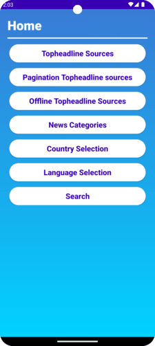
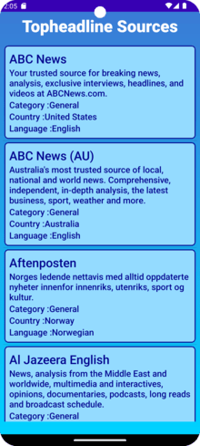
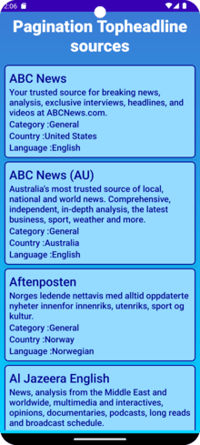
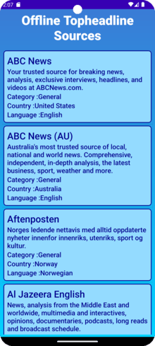
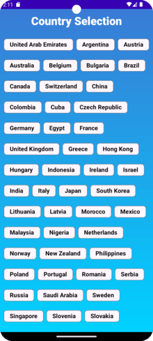
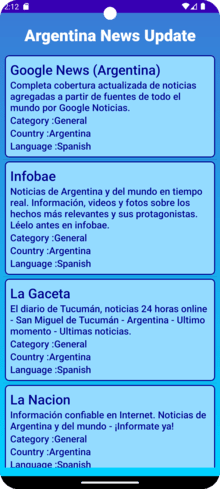
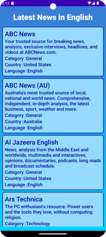
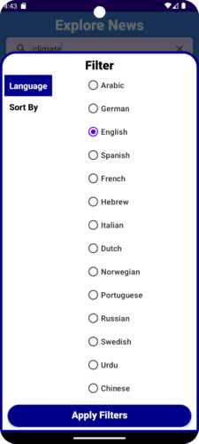
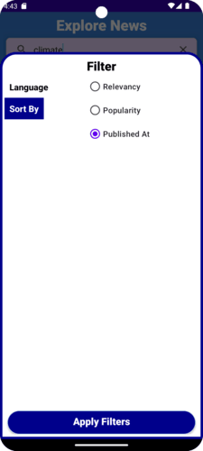

# NewsTrack

- Welcome to NewsTrack, a modern Android application designed to provide top-notch news content with
  advanced features and a user-friendly interface.

## Branches

- **main:** Jetpack Compose using Dagger Hilt
- **newstrack-jetpack-compose:** Jetpack Compose using Dagger Hilt
- **newstrack-daggerhilt:** XML using Dagger Hilt
- **newstrack-dagger2:** XML using Dagger 2

## Major Highlights

- **Jetpack Compose** : Modern UI toolkit for building sleek and dynamic interfaces.
- **MVVM Architecture** : Clean and scalable code structure.
- **Dagger Hilt** : Simplifies dependency injection.
- **Retrofit** : Seamless API integration for networking.
- **Room Database** : Efficient local storage for news articles.
- **Coroutines and Flow** : Smooth asynchronous programming.
- **StateFlow** : Efficient state management.
- **Pagination** : Efficiently loads large news lists.
- **WebView Integration** : Read full news articles seamlessly.
- **Instant Search** : Find relevant news using Flow operators.

## Dependencies Used

- **Jetpack Compose** – Modern UI toolkit for building native Android interfaces.
- **Coil** – Efficient image loading and caching.
- **Retrofit** – Type-safe HTTP client for network requests.
- **Dagger Hilt & Dagger 2** – Simplifies dependency injection.
- **Room** – SQLite-based database library for local storage.
- **Paging Compose** – Manages paginated lists smoothly.
- **Mockito, JUnit, Turbine** – Tools for testing and ensuring app reliability.

## Migrating XML Project to Jetpack Compose

Follow these steps to migrate an existing XML-based Android project to Jetpack Compose:

1. Update Dependencies
    - Upgrade to the latest Android Gradle Plugin and Kotlin Plugin.
    - Add Jetpack Compose dependencies in build.gradle (module-level).
2. Set Up Compose
    - Create a new @Composable function for your UI components.
3. Replace XML Layouts
    - Convert XML layouts into Compose functions.
    - Example: Replace <TextView> in XML with the Text() composable in Compose.
4. Adopt Compose Components
    - Replace traditional UI elements with Compose equivalents (e.g., Button, LazyColumn).
5. Migrate Navigation
    - Move from XML-based navigation to Compose Navigation.
6. Update UI Logic
    - Refactor UI logic using Compose state management (remember, State, MutableState).
7. Migrate Resources
    - Ensure string resources, colors, and drawables are properly integrated into Compose.
8. Update Gradle Configurations
    - Adjust Gradle dependencies to support Jetpack Compose. 
9. Testing
    - Use Compose testing libraries to write UI tests.
10. Learn & Document
    - Refer to the Jetpack Compose documentation for best practices.


## Migrating Dagger2 Project to Dagger Hilt
Follow these steps to migrate from Dagger2 to Dagger Hilt:

1. Add Hilt Dependencies
    - Include Hilt dependencies in build.gradle (module-level).
2. Apply Hilt Plugin
    - In build.gradle, apply:
    plugins {
         id 'com.google.dagger.hilt.android'
     }
3. Annotate the Application Class
    - Add @HiltAndroidApp to your Application class.
4. Update Dagger Annotations
    - Replace Dagger annotations with Hilt equivalents:
      - @Component → @HiltComponent (not required in Hilt, handled automatically).
      - @Inject remains the same.
5. Replace Dagger Modules
    - Convert Dagger modules to Hilt modules using @Module and @InstallIn.
6. Inject Dependencies in Activities & Fragments
    - Replace Dagger’s AndroidInjector with Hilt’s @AndroidEntryPoint.
7. ViewModel Injection
    - Replace Dagger’s ViewModelFactory with Hilt’s @HiltViewModel.
8. Update Testing Components
    - Replace Dagger test components with HiltAndroidRule and HiltAndroidTest.

## How to Run the Project

- Clone the Repository:
  git clone https://github.com/chandanasmenon/NewsTrack.git
- Visit newsapi.org and sign up for an API key.
- Copy the API key provided.
- Open the AppConstant.kt file. Replace "API_KEY" with the API key you obtained.
- Build and run the NewsApp.

## The Complete Project Folder Structure

```
└── com
    └── chandana
        └── newstrack
            ├── NewsApplication.kt
            ├── data
            │   ├── remote
            │   │   └── NetworkService.kt
            │   ├── local
            │   │   ├── AppDatabase.kt
            │   │   ├── AppDatabaseService.kt
            │   │   ├── DatabaseService.kt
            │   │   ├── dao
            │   │        └──  SourceDao.kt
            │   │   └── entity
            │   │         └── Source.kt
            │   ├── model
            │   │   ├── ApiSource.kt
            │   │   ├── Article.kt
            │   │   ├── Code.kt
            │   │   ├── Entity.kt
            │   │   ├── NewsSourcesResponse.kt
            │   │   ├── SearchResponse.kt
            │   │   └── TopHeadlineSources.kt
            │   └── repository
            │       ├── topheadlinesources
            │       │   ├── OfflineTopHeadlinesRepository.kt
            │       │   ├── TopHeadlinePagingRepository.kt
            │       │   ├── TopHeadlinePagingSource.kt
            │       │   ├── TopHeadlineSourcesRepository.kt
            │       ├── CategoryNewsRepository.kt
            │       ├── CountryNewsRepository.kt
            │       ├── LanguageNewsRepository.kt
            │       ├── SearchRepository.kt
            ├── di
            │   ├── component
            │   │   └── ActivityComponent.kt
            │   │   └── ApplicationComponent.kt
            │   ├── module
            │   │   └── ActivityModule.kt
            │   │   └── ApplicationModule.kt
            │   └── qualifiers.kt
            │   └── scopes.kt
            ├── ui
            │   ├── base
            │   │   ├── ViewModelProviderFactory.kt
            │   │   └── UiState.kt
            │   ├── categorynews
            │   │   ├── CategoryDisplayActivity.kt
            │   │   └── CategoryNewsActivity.kt
            │   │   ├── CategoryNewsAdapter.kt
            │   │   └── CategoryNewsViewModel.kt
            │   ├── countrynews
            │   │   ├── CountryDisplayActivity.kt
            │   │   └── CountryNewsActivity.kt
            │   │   ├── CountryNewsAdapter.kt
            │   │   └── CountryNewsViewModel.kt
            │   ├── homescreen
            │   │   ├── MainActivity.kt
            │   ├── languagenews
            │   │   ├── LanguageDisplayActivity.kt
            │   │   └── LanguageNewsActivity.kt
            │   │   ├── LanguageNewsAdapter.kt
            │   │   └── LanguageNewsViewModel.kt
            │   ├── offlinetopheadlines
            │   │   ├── OfflineTopHeadlinesActivity.kt
            │   │   └── OfflineTopHeadlinesAdapter.kt
            │   │   ├── OfflineTopHeadlinesViewModel.kt
            │   ├── pagingtopheadlinesources
            │   │   ├── TopHeadlinesPagingActivity.kt
            │   │   └── TopHeadlinesPagingAdapter.kt
            │   │   ├── TopHeadlinesPagingViewModel.kt
            │   ├── topheadlinesources
            │   │   ├── TopHeadlineSourcesActivity.kt
            │   │   └── TopHeadlineSourcesAdapter.kt
            │   │   ├── TopHeadlineViewModel.kt
            │   ├── searchnews
            │   │   ├── FilterDataAdapter.kt
            │   │   └── SearchActivity.kt
            │   │   ├── SearchNewsAdapter.kt
            │   │   ├── SearchNewsViewModel.kt
            ├── utils
            │   ├── AppConstant.kt
            │   ├── DefaultDispatcherProvider.kt
            │   ├── HeaderInterceptor.kt
            │   ├── NetworkHelper.kt
            │   ├── typealias.kt
            │   ├── extensions
            │   │   ├── ContextExtensions.kt
            │   │   ├── ImageViewExtensions.kt
            │   │   └── StringExtensions.kt
            
```

# Different screens in NewsTrack app

## Home Screen

The home screen features buttons for navigating to different sections of the app:

- Top Headline Sources
- Paginated Top Headlines Sources
- Offline Top Headlines Sources
- News Categories
- Country Selection
- Language Selection
- Search News

Tap any button to go to the respective screen.



## TopHeadline Sources

- This screen displays different topheadline sources of news.
- Tap on any source to explore its news.



## Pagination TopHeadline Sources

- Browse top headline sources with pagination.
- Tap a source to view its news.



## Offline TopHeadline Sources

This screen displays top headline sources even without an internet connection.

- If the network is available, it fetches data from the internet.
- If the network is unavailable, it loads saved data from the Room database.

Tap on any source to view its news.



## News Categories

Select a news category to explore relevant articles.

Categories include:

- Business
- Entertainment
- General
- Health
- Science
- Sports
- Technology


## Category-Based News

- View news sources based on the selected category.

  

## Country Selection

- Select a country to view news sources specific to that region.
- Supported countries include the United States, United Kingdom, India, Germany, France, Japan,
  Australia, Canada and many more.



## Country-Based News

- View news sources based on the selected country.

     

## Language Selection

- Choose a language to view news sources in that language.
- The supported languages are Arabic (ar), German (de), English (en), Spanish (es), French (fr) and
  many more.


## Language-Based News

- View news sources based on the selected language.

     

## Search News

The search screen displays news results based on your query. A minimum of 3 characters is required
to show results.

Features:
Instant search powered by Flow operators:

- Debounce – Reduces unnecessary searches while typing.
- Filter – Ensures searches only run when the query has at least 3 characters.
- DistinctUntilChanged – Prevents duplicate searches for the same query.
- FlatMapLatest – Cancels previous searches when a new query is entered.

These optimizations make searching faster and more efficient.


## Filter Search News

Advanced filtering options allow you to refine news results.

Currently two filters are available:

- Language
- Sort By

After selecting filters, click the Apply Filter button to update the search results.

     
  
